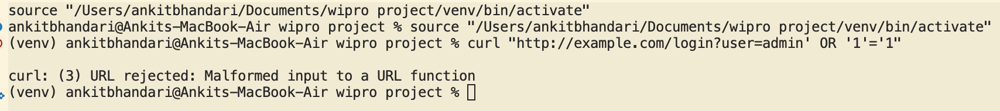
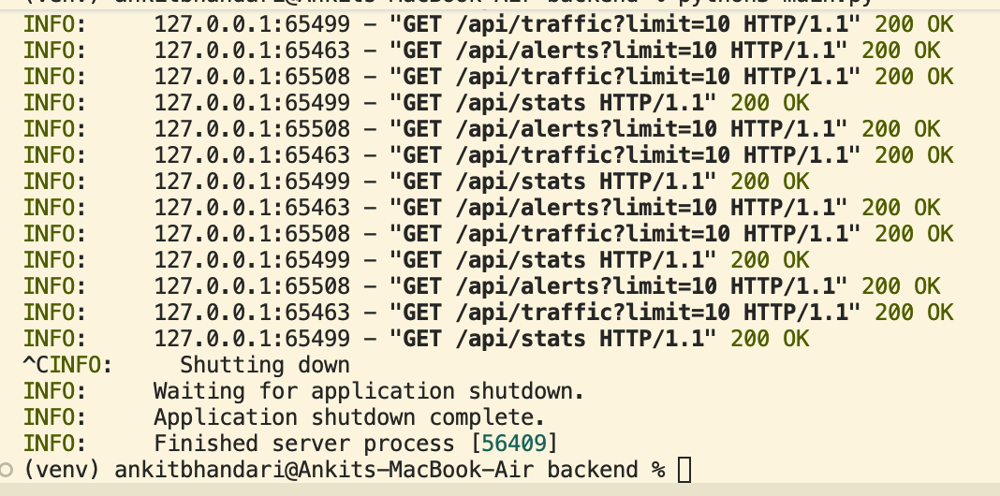
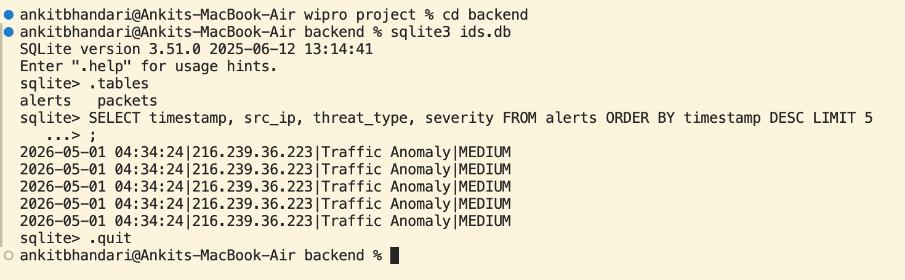

# Hybrid IDS/IPS Dashboard



A Hybrid Intrusion Detection System (IDS) and Intrusion Prevention System (IPS) with a real-time monitoring dashboard. This system analyzes network traffic to identify and flag potential security threats using both signature-based detection and machine learning-based anomaly detection (Isolation Forest).

## Features

- **Real-Time Packet Sniffing**: Captures raw network traffic and parses packets.
- **Signature-Based Detection**: Identifies known attack vectors such as SQL Injection, Directory Traversal, and Nmap Scans based on predefined rules.
- **Machine Learning Anomaly Detection**: Uses an Isolation Forest model to detect unusual network patterns that might indicate a zero-day or unknown threat.
- **Interactive Dashboard**: A React-based web interface to monitor network traffic, view real-time statistics, and inspect security alerts.
  
  

- **SQLite Database**: Persistent storage for captured packets, security alerts, and blocked IPs.

## Tech Stack

- **Backend**: Python, FastAPI, SQLite3, Scapy (for packet sniffing), Scikit-Learn (for anomaly detection).
- **Frontend**: React, Vite, Tailwind CSS, Lucide React (for icons).

## Project Structure

```
├── backend/
│   ├── core/
│   │   ├── anomaly.py         # ML anomaly detection using Isolation Forest
│   │   ├── database.py        # Database connection and queries
│   │   ├── ips.py             # Intrusion Prevention logic
│   │   ├── signature.py       # Signature-based threat rules
│   │   ├── sniffer.py         # Packet sniffing script (requires root/sudo)
│   │   ├── train_model.py     # Script to train the ML model
│   │   └── isolation_forest.pkl # Pre-trained ML model
│   ├── ids.db                 # SQLite database storing packets and alerts
│   └── main.py                # FastAPI server powering the dashboard
├── frontend/
│   ├── public/
│   ├── src/                   # React components for the dashboard
│   ├── package.json           # Frontend dependencies
│   ├── tailwind.config.js     # Tailwind CSS configuration
│   └── vite.config.js         # Vite configuration
├── requirements.txt           # Python dependencies for the backend
└── README.md                  # This file
```

## Setup and Installation

### 1. Backend Setup

1. **Create and activate a virtual environment:**
   ```bash
   python3 -m venv venv
   source venv/bin/activate
   ```
2. **Install Python dependencies:**
   ```bash
   pip install -r requirements.txt
   ```

### 2. Frontend Setup

1. **Navigate to the frontend directory:**
   ```bash
   cd frontend
   ```
2. **Install Node.js dependencies:**
   ```bash
   npm install
   ```

## Running the Application

To fully run the system, you will need to start three separate processes in three different terminal windows.

**1. Start the FastAPI Backend Server**
```bash
# Ensure your virtual environment is activated
cd backend
python3 main.py
```
*The API will be available at `http://localhost:8000`.*



**2. Start the Frontend Dashboard**
```bash
cd frontend
npm run dev
```
*The dashboard will be available at `http://localhost:5173`.*

**3. Start the Packet Sniffer (Requires Root/Admin)**
The sniffer monitors raw network traffic and populates the database with packets and alerts.
```bash
cd backend
sudo python3 core/sniffer.py
```
*(You may be prompted for your Mac/Linux password. By default, it listens on `en0`.)*

## Testing the IDS (Simulating Attacks)

With the sniffer running, open a separate terminal and run these `curl` commands to simulate network attacks. The sniffer will detect them and they will appear on your dashboard!

**1. Simulate an Nmap Scan (Low Severity)**
Triggers a rule by spoofing the User-Agent.
```bash
curl -A "Nmap Scripting Engine" http://example.com
```

**2. Simulate a Directory Traversal Attack (Medium Severity)**
Triggers a rule by attempting to access restricted paths.
```bash
curl "http://example.com/../../etc/passwd"
```

**3. Simulate a SQL Injection (High Severity)**
Triggers a rule by sending a classic SQL injection payload.
```bash
curl "http://example.com/login?user=admin' OR '1'='1"
```

Check your sniffer terminal to see the alerts printed in real-time, and view the frontend dashboard to see the statistics and alerts table update automatically!


## Database Management

You can inspect the captured data directly using the `sqlite3` command-line tool.



1. Navigate to the backend folder and open the database:
   ```bash
   cd backend
   sqlite3 ids.db
   ```
2. Format the output for readability:
   ```sql
   .mode column
   .headers on
   ```
3. View the latest alerts or packets:
   ```sql
   SELECT timestamp, src_ip, threat_type, severity FROM alerts ORDER BY timestamp DESC LIMIT 5;
   SELECT timestamp, src_ip, dst_ip, protocol, length FROM packets ORDER BY timestamp DESC LIMIT 5;
   ```
4. Exit SQLite:
   ```sql
   .quit
   ```
